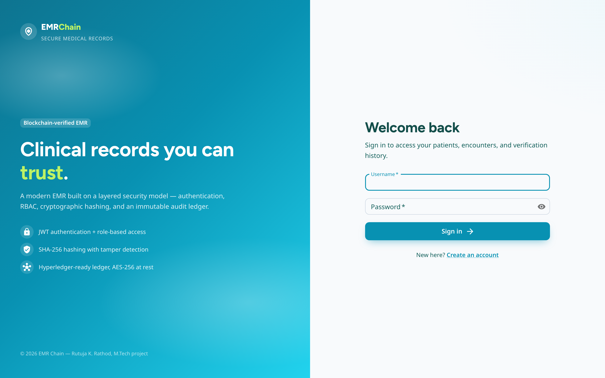
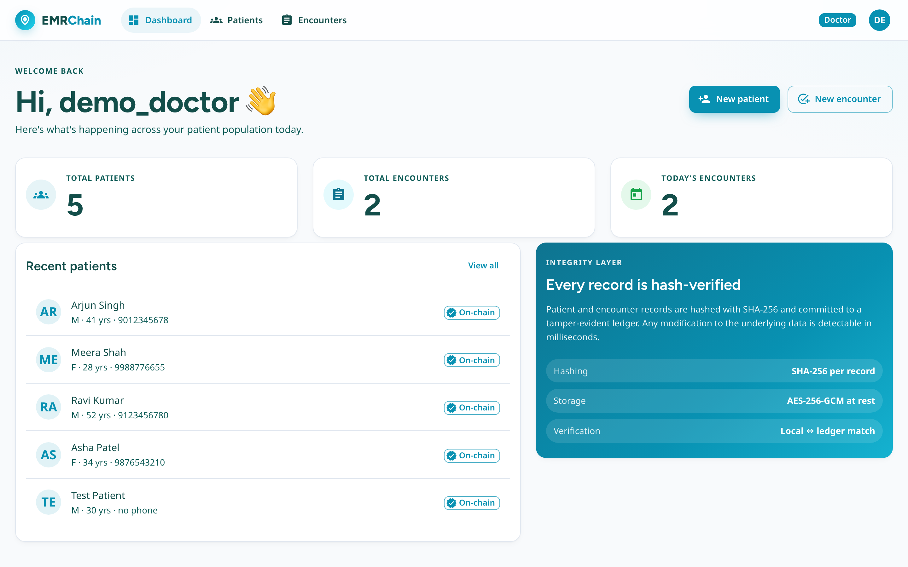
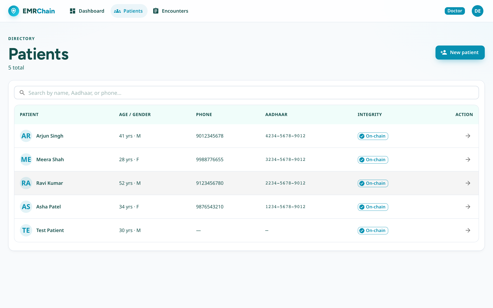
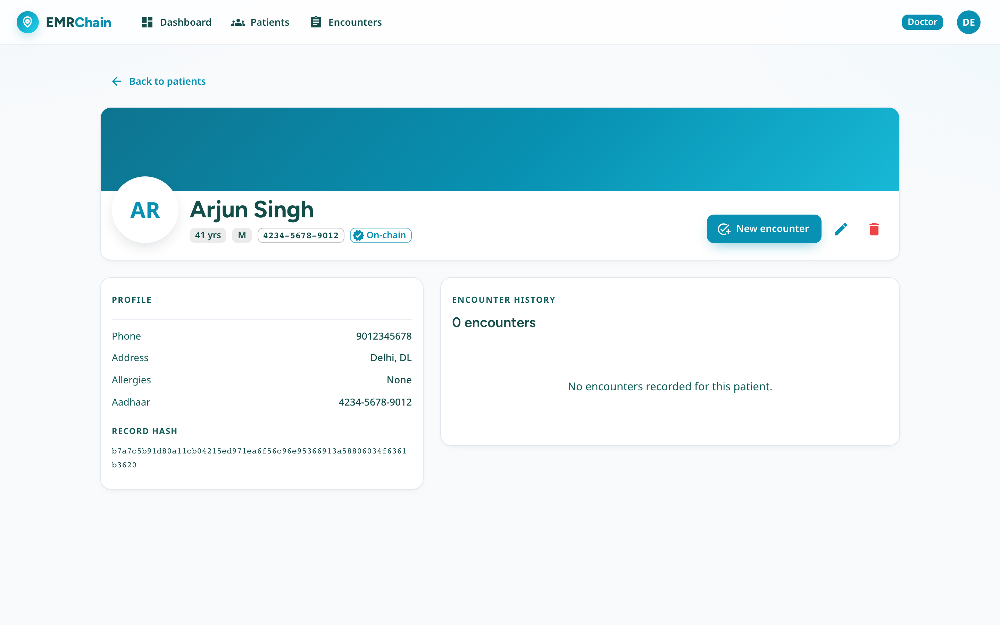
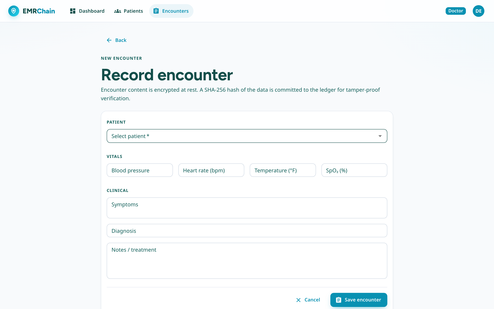
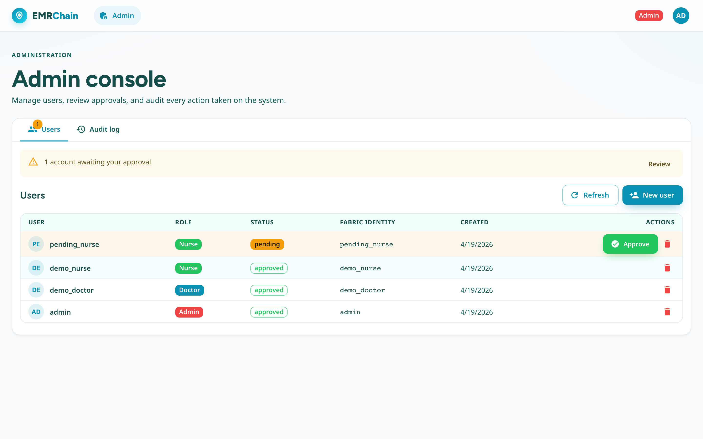
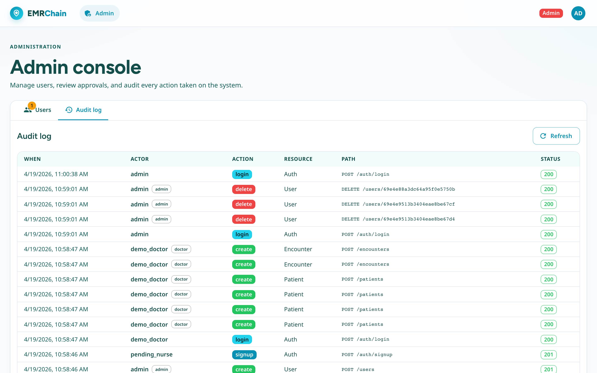
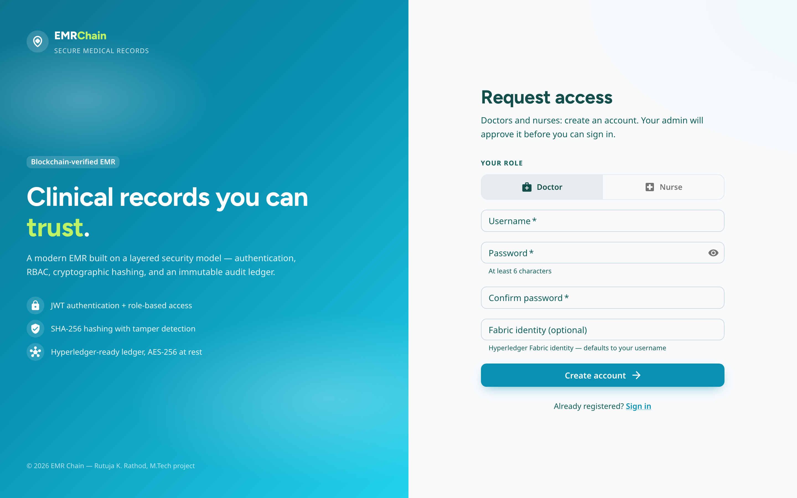
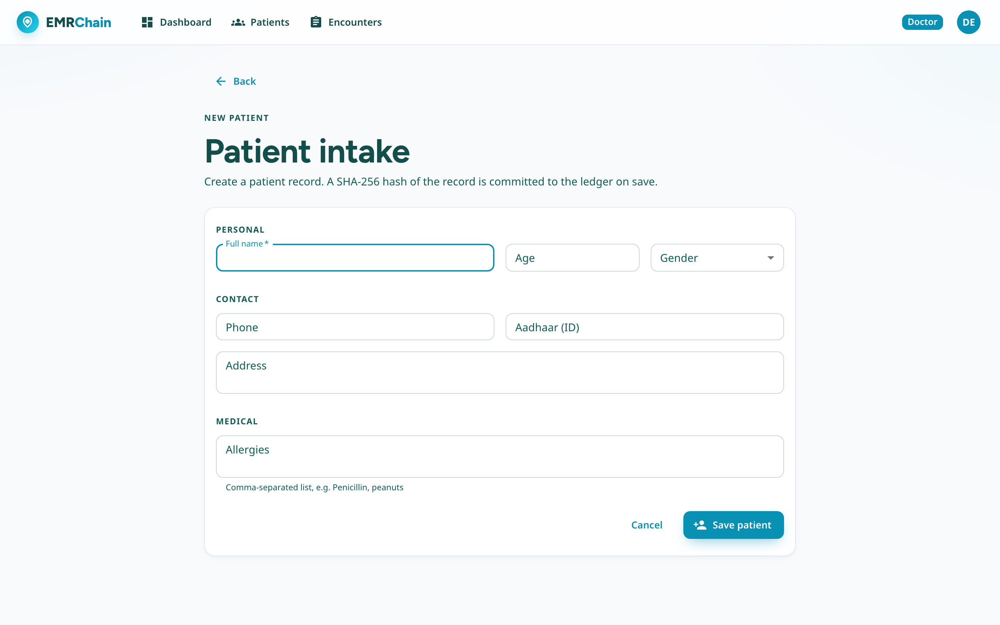

# EMR Chain

A healthcare Electronic Medical Record app backed by a local tamper-evident
ledger. Doctors and nurses manage patients and encounters; every record is
SHA-256 hashed and chained. Admins approve accounts and audit activity.



---

## Prerequisites

Install **Docker Desktop** (or Docker Engine + Compose v2):

- macOS / Windows: <https://www.docker.com/products/docker-desktop>
- Linux: your distro's `docker` and `docker-compose-plugin` packages

Verify:

```bash
docker --version          # Docker version 29.x or newer
docker compose version    # v2.x (not `docker-compose`)
```

Nothing else is required on the host — Node, MongoDB, and nginx all run
inside containers.

---

## Quick start

### 1. Clone the repository

```bash
git clone https://github.com/rutugith/emr-blockchain.git
cd emr-blockchain
```

### 2. Create the environment file

Copy the template and fill in real secrets:

```bash
cp .env.example .env
```

Then edit `.env`. The two values you **must** replace are `JWT_SECRET` and
`ENCRYPTION_KEY`. Generate them with:

```bash
# JWT_SECRET — 96-char hex (48 bytes)
node -e "console.log(require('crypto').randomBytes(48).toString('hex'))"

# ENCRYPTION_KEY — 64-char hex (32 bytes, AES-256)
node -e "console.log(require('crypto').randomBytes(32).toString('hex'))"
```

The resulting `.env` should look like:

```env
JWT_SECRET=<96-char hex>
ENCRYPTION_KEY=<64-char hex>
ADMIN_USERNAME=admin
ADMIN_PASSWORD=<change-me-to-something-strong>
CORS_ORIGINS=http://localhost:3000
REACT_APP_API_URL=http://localhost:4000
```

> `ENCRYPTION_KEY` is used to encrypt encounter notes, diagnoses, symptoms, and
> vitals at rest. **Changing it later makes existing encounter data unreadable**,
> so set it once and keep it safe.

### 3. Start the stack

```bash
docker compose up --build -d
```

First run takes 3–5 minutes while images are pulled and the React bundle is
built. Subsequent starts are seconds.

When the command returns, check all three services are healthy:

```bash
docker compose ps
```

Expected output:

```
NAME                   SERVICE    STATUS
emr-chain-mongo-1      mongo      Up (healthy)
emr-chain-backend-1    backend    Up (healthy)
emr-chain-frontend-1   frontend   Up (healthy)
```

### 4. Open the app

- Frontend: <http://localhost:3000>
- Backend (API health): <http://localhost:4000/health>

---

## First login and account approval

On first start, the backend seeds a single admin user from your `.env`. No
other accounts exist yet. Here's the end-to-end flow:

### 1. Log in as the admin

Go to <http://localhost:3000> and sign in with the `ADMIN_USERNAME` /
`ADMIN_PASSWORD` you set in `.env`. Admins land on the **Admin** console.

### 2. Create doctors and nurses (two options)

**Option A — admin provisions directly.** In the Admin console → **Users**
tab → **New user**. Fill in username, password, pick a role. These accounts
are approved immediately and can log in right away.

**Option B — self-signup with approval.** On the login page, click
**Sign up** and create a doctor or nurse account. The account is created
with `status: pending` and **cannot log in yet**. An admin sees the pending
row in the Users tab (highlighted yellow) and clicks **Approve** to let the
account in.

### 3. Use the app as a doctor

Log out, log back in as a doctor (e.g. the one you just created). You'll be
routed to the Dashboard. From there:

- **Patients → New patient** to add a record (hash + ledger entry are
  generated automatically).
- **Patients** to search and open any patient.
- **Encounters** on a patient page to record a new encounter. Encounter
  content is encrypted at rest; only the SHA-256 hash lives on the ledger.
- Click **Verify on blockchain** on any encounter to confirm the stored
  data still matches the ledger.

### 4. Review activity as admin

Back in the Admin console → **Audit log** tab: every mutation (logins,
signups, create/update/delete, password changes) is recorded with the
actor, path, HTTP status, and timestamp.

---

## Role permissions

Admins run the organization — they do not touch clinical data. Doctors
and nurses handle patients and encounters.

| Action | Admin | Doctor | Nurse |
|---|:-:|:-:|:-:|
| Sign in | ✅ | ✅ | ✅ |
| Change own password | ✅ | ✅ | ✅ |
| Manage users (create / approve / delete) | ✅ | ❌ | ❌ |
| View audit log | ✅ | ❌ | ❌ |
| View patients and encounters | ❌ | ✅ | ✅ |
| Verify records on the ledger | ❌ | ✅ | ✅ |
| Create / update / delete a patient | ❌ | ✅ | ❌ |
| Create an encounter | ❌ | ✅ | ❌ |

Enforcement happens on the API. Any forbidden request returns a helpful
message such as *"You are not authorized to do that — please ask a doctor
to do it."*

---

## Screenshots

| Doctor dashboard | Patients directory |
|---|---|
|  |  |

| Patient details + encounters | Record a new encounter |
|---|---|
|  |  |

| Admin — users & approvals | Admin — audit log |
|---|---|
|  |  |

| Sign up | Patient intake |
|---|---|
|  |  |

---

## Common operations

```bash
# Tail logs for one service
docker compose logs -f backend
docker compose logs -f frontend
docker compose logs -f mongo

# Stop the stack (keep data)
docker compose down

# Stop AND wipe all data (Mongo + ledger.json)
docker compose down -v

# Rebuild after code changes
docker compose up --build -d

# Restart a single service
docker compose restart backend

# Shell into a running container
docker compose exec backend sh
docker compose exec mongo mongosh emr
```

---

## Ports and volumes

| Port | Service | Notes |
|------|---------|-------|
| 3000 | frontend | nginx serving the React build |
| 4000 | backend | Express API |
| 27017 | mongo | Internal only; **not** published to the host |

| Volume | Contents |
|--------|----------|
| `mongo_data` | MongoDB database files |
| `ledger_data` | `ledger.json` — the tamper-evident block chain of record hashes |

Both volumes persist across `docker compose down` and are only deleted by
`docker compose down -v`.

---

## Troubleshooting

**Port 3000 or 4000 already in use.** Something else on your host is
bound. Find it with `lsof -i :3000` (or `:4000`) and stop it, or change the
published port in `docker-compose.yml` (e.g., `"3001:80"`).

**"Too many failed login attempts" error.** You tripped the login rate
limiter (10 failed attempts per 15 min per IP). Successful logins don't
count. To reset immediately, restart the backend: `docker compose restart
backend`.

**Forgot the admin password.** With the stack stopped:
`docker compose down -v` wipes the DB, and the next `up` will re-seed the
admin from your current `.env`. Any existing encounter data is lost.

**Encrypted data looks garbled in Mongo.** That's correct — encounter
`notes`/`symptoms`/`diagnosis`/`vitals` are AES-256-GCM encrypted at rest
and only decrypted when the API returns them through the app.

**Frontend shows old UI after a code change.** The React bundle is baked
into the image at build time. Rebuild: `docker compose up --build -d
frontend`.
